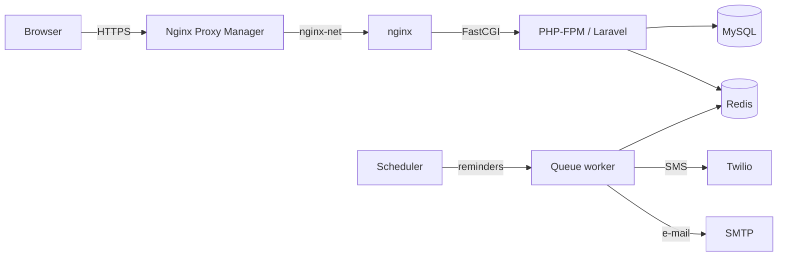

# Booking SaaS

A multi-tenant appointment platform for barbershops. Every shop gets its own branded landing page with a mobile-first booking wizard. Customers book in under a minute with no account and no password: an SMS code confirms the phone number, and that phone number is their identity. Shop owners run their calendar, staff, services and public profile from a Filament admin panel.

## Key features

**For customers**
- **Mobile-first booking wizard:** service → barber, date and time → details → SMS code → done. It has native-feeling touch targets, a swipeable date strip, and drag-to-scroll on desktop.
- **Passwordless SMS verification:** a 6-digit code (10-minute TTL, 5 attempts) confirms the booking, and nothing is saved until it does. Returning customers are recognised by phone number.
- **Anti-spam:**
  - A phone number can hold only one upcoming appointment per shop.
  - OTP requests are rate-limited per IP and per phone (per minute, hour and day).
  - The slot is re-checked before any SMS is spent.
- **Self-service cancellation:** a private, unguessable link in the confirmation SMS/e-mail. No login required.
- **Reminders:** automatic SMS and e-mail reminders before each appointment (24 hours by default).

**For shops**
- **Branded landing page:** tagline, about text, hero image, address with a directions link, tap-to-call phone, social links, opening hours and team.
- **Per-shop timezone and currency:** slots, "today" and prices are always in the shop's local terms.
- **Admin panel (Filament):**
  - A dashboard showing today's appointments, upcoming revenue and customer count.
  - Appointments, services, staff, and shop profile management.

**Platform**
- **Global directory:** `/book` shows a shop picker and a sample of barbers from across the platform.
- **Roles:** super admins manage every shop. Shop admins see only their own data.

## Tech stack

| Layer | Technology |
|---|---|
| Backend | PHP 8.4, Laravel 13, Laravel Sanctum |
| Admin panel | Filament 3 (Livewire 3) |
| Frontend | Blade, Alpine.js 3, Tailwind CSS 4, Vite |
| Data | MySQL 8, Redis 7 (cache, queues, rate limits) |
| Messaging | Twilio SMS (log driver in development), Mailpit for local e-mail |
| Infrastructure | Docker Compose, nginx, Nginx Proxy Manager, GitHub Actions |

## Architecture



### Code layout

- **Thin controllers:** controllers validate through Form Requests and delegate to single-purpose action classes in `app/Actions`:
  - `GetAvailableSlotsAction`
  - `RequestBookingOtpAction`
  - `ConfirmBookingOtpAction`
  - `CreateBookingAction`
  - `CancelBookingAction`
- **Services and DTOs:** cross-cutting logic lives in services such as `BookingOtpBroker` and `DashboardStatsService`. Data moves between layers as readonly DTOs in `app/Data`.
- **Booking concurrency:** `CreateBookingAction` runs in a transaction that locks the candidate staff rows and the customer row. Concurrent requests can't double-book a barber, and one phone number can't turn two pending codes into two appointments. When a customer asks for "any barber", the least busy free barber that day is assigned.
- **Time handling:** everything is stored in UTC and interpreted in each shop's timezone. That covers business hours, slot generation, "today" on the dashboard, and reminder windows.

### Multi-tenant design

Single database, shared schema, with a `tenant_id` on every tenant-owned table.

- **Automatic scoping:** the `BelongsToTenant` trait adds a global `TenantScope`, which limits a signed-in shop admin to their own tenant's rows. The same trait forces `tenant_id` on anything they create, so they can't write into another shop.
- **Explicit scoping where it matters:**
  - Public pages, the booking API and dashboard stats filter by tenant explicitly rather than relying on who is logged in.
  - Stats fail closed: a shop admin with no shop sees zeros, never platform totals.
- **Shops themselves:** the `tenants` table has no `tenant_id`. `TenantResource` and `TenantPolicy` restrict shop admins to their own shop and lock the public slug, since changing it would break printed links and QR codes.
- **Customers are global:** one phone number is one customer across all shops. Per-shop figures, such as customer counts, are derived from that shop's appointments, not from the users table.
- **Dynamic branding:** each shop's profile (tagline, about text, hero image, contact details, socials, currency, timezone) is editable in the admin panel and rendered server-side. The landing page falls back to neutral copy and a stock photo, and never shows a made-up address or phone number.

## Infrastructure & DevOps

### Containers

`docker-compose.yml` runs:

| Service | Purpose |
|---|---|
| `permissions` | One-shot: repairs `storage/` and `bootstrap/cache/` ownership before PHP starts |
| `app` | PHP-FPM application |
| `webserver` | nginx serving `public/` and passing PHP to `app` |
| `queue` | `queue:work` for notifications |
| `scheduler` | `schedule:work` for reminders |
| `mysql` | Database, with a named volume |
| `redis` | Cache, queues and rate limits |
| `mailpit` | Local e-mail inbox, persisted in a named volume |
| `node` | Frontend tooling on demand (`tools` profile), runs as the host user |

`CONTAINER_PREFIX` and the port variables in the root `.env` let dev and prod stacks run side by side on one host.

### Reverse proxy and HTTPS

Nginx Proxy Manager terminates TLS and reaches the stack over the shared external `nginx-net` network.

- **Trusted headers:** Laravel trusts `X-Forwarded-For` and `X-Forwarded-Proto`, so it generates `https://` URLs and sees real client IPs.
- **Spoofing protection:**
  - The app's nginx passes those headers to PHP only for requests coming from the proxy's network (`docker/nginx/default.conf`). Anyone hitting the published port directly can't fake an IP to get around the rate limits.
  - The client IP is taken from `X-Real-IP`, because the proxy appends to a client-supplied `X-Forwarded-For`.
- **Upload limits:** raised consistently in nginx (`client_max_body_size`) and PHP (`docker/php/uploads.ini`).

### File permissions

The source is bind-mounted into every PHP container, so the containers and the host user share one file tree. Rather than juggling two owners with ACLs, **every process runs as one UID that matches the host user**:

- **Remapped user:** `docker/php/Dockerfile` remaps `www-data` to `HOST_UID`/`HOST_GID` (default `1000`) and makes it the image's default user. PHP-FPM, the queue worker, the scheduler and every `docker compose exec app php artisan …` therefore create files as the same user that runs `git pull`.
- **Why not ACLs:** ACLs can grant write access, but not ownership. Blade's `touch($compiled, $mtime)` sets an explicit mtime, which the kernel only allows for the file's owner. That is the source of `touch(): Utime failed: Operation not permitted` whenever a root-run artisan command compiled a view that PHP-FPM later refreshed.
- **Self-healing:** a one-shot `permissions` service runs as root on every `docker compose up`, before the PHP containers start. It hands anything in `storage/` and `bootstrap/cache/` that a root or old-UID process left behind back to `www-data`. The deploy workflow runs it again explicitly.
- **Frontend builds:** these run through the `node` tools service as the host user, so `public/build` is never root-owned.

If your host UID/GID isn't 1000, set `HOST_UID`/`HOST_GID` in the root `.env` and rebuild. Avoid `docker compose exec -u root app php artisan …`. If it happens anyway, the next `docker compose up -d` (or `docker compose run --rm permissions`) repairs the tree.

### CI/CD (GitHub Actions)

- **`ci.yml`:** runs on every pull request to `main`, on a GitHub-hosted runner. It installs PHP 8.4 and Node 22, builds the frontend, and runs the full PHPUnit suite on in-memory SQLite with a Redis service container.
- **`deploy.yml`:** runs on every push to `main`. It first reuses `ci.yml`. Only when the tests pass does a **self-hosted runner** deploy that exact commit to the production checkout:
  1. Maintenance mode on.
  2. `git reset --hard <sha>`.
  3. `docker compose up -d --build`, then restart nginx so the bind-mounted config is reloaded.
  4. Repair file ownership (`permissions` service), then `composer install --no-dev`.
  5. Build the frontend in the `node` service, as the runner user.
  6. `storage:link`, `migrate --force`, `optimize`, `filament:optimize`, `queue:restart`.
  7. Maintenance mode off, even if a step fails.

  A concurrency group prevents two deploys from running at once.

### Environments

| | Path | Compose project | Web |
|---|---|---|---|
| Dev | `~/docker/booking-saas` | `booking-saas` (`booking-*` containers) | :8090 |
| Prod | `~/docker/production-booking-saas` | `booking-prod` (`booking-prod-*` containers) | :8091 |

The deploy workflow only ever touches the prod path. The dev checkout, its containers and its MySQL volume are never modified by CI.

#### One-time prod bootstrap

```bash
git clone https://github.com/markosavicle/booking-saas.git ~/docker/production-booking-saas
cd ~/docker/production-booking-saas
cp .env.example .env         # CONTAINER_PREFIX=booking-prod, WEB_PORT=8091, MAILPIT_PORT=8026, fresh DB passwords
cp src/.env.example src/.env # APP_ENV=production, APP_DEBUG=false, DB_HOST=mysql, matching DB creds
COMPOSE_PROJECT_NAME=booking-prod docker compose up -d --build
COMPOSE_PROJECT_NAME=booking-prod docker compose exec app sh -c 'composer install --no-dev -o && php artisan key:generate --force'
```

Then re-run the "Deploy Booking SaaS" workflow (Actions → Run workflow) and point the reverse proxy at `booking-prod-web:80`.

## Local development

**Prerequisites:** Docker with Compose, and an external `nginx-net` network (`docker network create nginx-net` if you don't run Nginx Proxy Manager).

```bash
git clone https://github.com/markosavicle/booking-saas.git && cd booking-saas
cp .env.example .env            # DB credentials, container prefix, ports, HOST_UID/HOST_GID
cp src/.env.example src/.env    # set DB_CONNECTION=mysql, DB_HOST=mysql and matching credentials; SMS_DRIVER=log

docker compose up -d --build
docker compose exec app composer install
docker compose exec app php artisan key:generate
docker compose exec app php artisan migrate --seed
docker compose exec app php artisan storage:link

# Frontend assets, built as your own user (never as root)
docker compose run --rm node sh -c 'npm ci && npm run build'
```

Then open:

| URL | What |
|---|---|
| http://localhost:8090/book | Shop picker and platform directory |
| http://localhost:8090/book/belgrade-central-cuts | A seeded shop's landing page |
| http://localhost:8090/admin | Admin panel |
| http://localhost:8025 | Mailpit |

The seeder creates three shops, each with staff, services, business hours and a profile.

| Login | Password | Role |
|---|---|---|
| `superadmin@example.com` | `password` | Super admin |
| `belgrade@example.com`, `novi-sad@example.com`, `nis@example.com` | `password` | Shop admins |

With `SMS_DRIVER=log`, OTP codes and reminders are written to `src/storage/logs/laravel.log` instead of being sent.

> ⚠️ `migrate --seed` and `migrate:fresh` are for a fresh database only. Never run them against a database whose data you want to keep.

## Testing

```bash
docker compose exec app php artisan test
```

- **Isolated database:** the suite runs on in-memory SQLite, never on the MySQL database. `tests/TestCase.php` refuses to refresh any other connection, so a misconfigured environment can't wipe real data.
- **Coverage:**
  - Slot generation across timezones and DST.
  - Booking concurrency rules.
  - The OTP flow, including expiry, attempt limits and anti-spam.
  - Rate limits and cancel links.
  - Reminders.
  - Tenant isolation in the admin panel and dashboard stats.
  - Trusted-proxy behaviour.
  - The landing pages.
